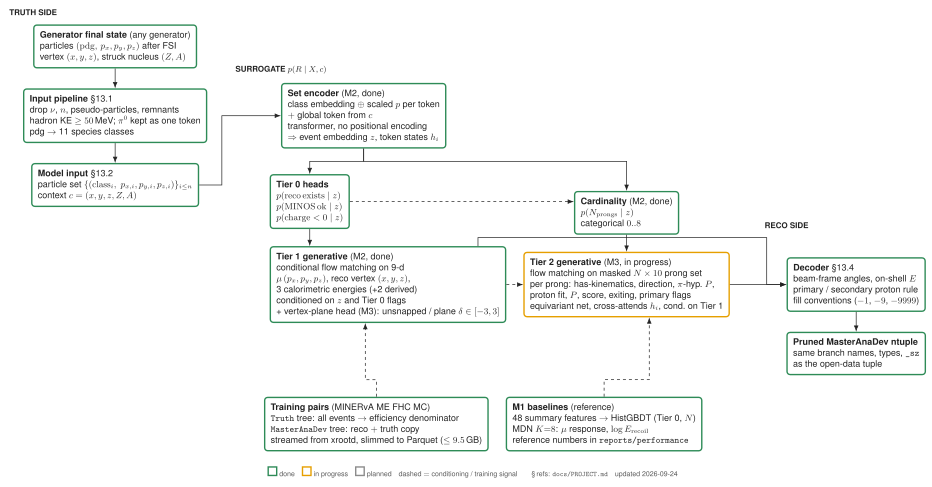

# MINERvA sim→reco surrogate: project design

Status: design agreed and M0 scaffold in place (2026-09-23). §10 records the decisions taken on the original open
questions; §13 fixes the data schema; §14 records the remaining definitions.

## 1. Goal

Learn, from the MINERvA open-data MC alone, a **per-event stochastic map from GENIE final-state truth to
MasterAnaDev reconstructed quantities**, and make it extrapolate sensibly beyond the phase space the released
MC covers.

Why this matters for open data specifically:

- The open-data release contains reconstructed MC with truth attached, but not the simulation chain
  (GENIE → Geant4 → overlay → reconstruction). An outside user can reweight the MC, but cannot generate
  reco-level predictions for a final state that GENIE 2.12.6 with the MINERvA tune did not produce.
- The natural application is therefore: take truth-level events from **another generator or model variation**
  (GENIE 3 tunes, NuWro, NEUT, ACHILLES, a different FSI model, more 2p2h, ...), run them through the
  surrogate, and compare to MINERvA data at reco level, or build a reco-level response matrix for a new signal
  definition. Reweighting cannot do this when the new model populates final states with different multiplicity,
  species, or kinematics.
- Secondary uses: fast MC for statistics-limited corners; sensitivity studies; a differentiable detector model.

What the surrogate is not: it does not fix data/MC disagreement. It is trained on MC and reproduces the MC
detector response, including its flaws. Its value is transporting that response to new truth inputs.

## 2. Problem statement

For one neutrino interaction, let

- `X` = the set of particles leaving the nucleus, each with species and 4-momentum (variable size),
- `c` = event-level context: true vertex position, struck target/material, beam configuration, and per-spill
  detector conditions,
- `R` = the reconstructed record, which is itself structured: a "was reconstructed at all" flag, a fixed block of
  event-level quantities (muon, vertex, calorimetric sums), and a **variable-size set of hadron prongs**.

We want to learn `p(R | X, c)`, sample from it, and characterize where the samples can be trusted.

Three properties of this problem drive the design:

1. **It is genuinely stochastic and multimodal.** In the file examined, muon momentum reco/true has a median of
   0.98 but a 16–84% band of [0.52, 1.13]; 36% of events are off by more than 20%. The reasons are discrete
   (MINOS-matched or not, range vs curvature, exiting muon). A regression to the mean is useless; we need a
   conditional generative model.
2. **Reco quality is an event property, not a particle property.** Reco multiplicity saturates near 2 while true
   charged-hadron multiplicity keeps growing (table in `tuple_notes.md`): tracks overlap, vertices get pulled,
   calorimetry mixes. A per-particle smearing table cannot represent this. Hence per-event.
3. **Everything visible on the reco side has to be explainable by what physically entered the detector.**
   This is the constraint that gives extrapolation a chance (§7).

## 3. Inputs: which truth particles, which features

**Particle set.** Use `mc_FSPart*` (equivalently `mc_er_*` with `status == 1`): GENIE's stable final state
**after** intranuclear FSI. These are exactly the particles that leave the nucleus and enter Geant4. The pre-FSI
hadronic system (`mc_er_status` 14 etc.) is invisible to the detector and must not be used. Concretely:

| Keep | Drop |
|---|---|
| mu±, e±, p, n, pi±, pi0, gamma, K±, K0/K0bar (K0L/K0S), Lambda, Sigma, other hyperons | outgoing neutrinos (PDG ±12, ±14, ±16): invisible |
| | GENIE pseudo-particle 2000000101 (binding energy carrier) |
| | nuclear remnants 100ZZZAAA0: recoil nuclei with keV–MeV KE, invisible |

Neutrons stay. They are the most common FS particle in this sample and they do produce visible energy (blobs,
extra prongs: 17% of events with zero true charged hadrons above threshold still have a second reco track).
pi0 and gamma stay for the same reason. The pi0 stays a **single token**: the tuple stores only the pi0, the γγ decay
happened inside Geant4 and is not recorded, so any decay we generate ourselves would be uncorrelated with the
actual event and would add noise without information.

**Per-particle features.** A learned embedding of the species class plus the raw 3-momentum `(px, py, pz)`
in detector coordinates (MeV). Energy, KE, and angles are functions of class and momentum and are left for the
network to derive. The only preprocessing is a fixed, invertible numeric scaling (an optimization detail, not a
modelling choice). The muon is an ordinary token with its own species class.

**Do not feed generator-internal labels.** `mc_intType` (QE/RES/DIS/2p2h), `mc_Q2`, `mc_w`, `mc_Bjorkenx/y`,
`mc_incomingE`, and `mc_targetNucleon` are not observable by the detector; the detector only sees `X`. A
surrogate that uses them would (a) learn shortcuts that break when a different generator labels things
differently, and (b) be impossible to apply to a generator that does not produce those labels. Excluding them
also gives us a clean extrapolation test: train on QE+RES, test on DIS (§7).

## 4. Conditioning: vertex, target, detector conditions

The question raised was whether the vertex is an input or a condition. Mathematically both `X` and `c` sit on
the right-hand side of `p(R | X, c)`; the model conditions on everything. The distinction that matters is
architectural and practical:

- **Is it something we want to vary independently at inference time?** For the vertex, yes: "same final state,
  different location" is a meaningful query (e.g. moving a hadronic system from tracker to a nuclear target
  region). That argues for treating it as an explicit, separately-controllable context vector.
- **Does it act on each particle or on the event as a whole?** The vertex acts on both. Globally it decides
  which material the event starts in and how much detector lies downstream. Per particle, it decides (together
  with the particle's direction) how much material the particle traverses before exiting, which drives
  containment and hence momentum-by-range vs. calorimetry.

Recommendation: put the vertex in the **global context vector** `c` and broadcast it to every particle token
(via a global token or FiLM). Together with each token's `(px, py, pz)` the network then has everything needed to
work out containment. An optional add-on, deferred for v1: "derived geometry" means a few scalars computed from
(vertex, direction) with the known detector geometry, e.g. the straight-line distance from the vertex to the
downstream end of the tracker, to the ECAL/HCAL boundary, and to the hexagonal side wall along the particle's
direction. They encode "how much material before this particle exits" explicitly, which is what decides
momentum-by-range vs. calorimetry. The network can learn this from raw coordinates; the features only make the
"new vertex" extrapolation smoother. Add them if the geometry holdout (§7) shows the model struggling.

Proposed contents of `c`:

| Quantity | Branch | Notes |
|---|---|---|
| True vertex (x, y, z) | `mc_vtx[0:3]` | Detector coordinates in mm. Time is irrelevant. |
| Target material | `mc_targetZ`, `mc_targetA`; `truth_targetID`, `truth_vtx_module` | Largely a function of z, but not fully (tracker is a C/H mix, water target, passive layers). Keep both raw position and material class. |
| Beam / playlist | `mc_beamConfig`; neutrino vs antineutrino mode | Constant within a playlist; needed when training across playlists (ME FHC vs RHC). |
| Detector conditions | `phys_n_dead_discr_pair` (dead channels), `numi_pot` (spill intensity → overlay pileup) | Considered and **dropped for v1** after measuring negligible correlation with the reco targets (§13.2); the model marginalizes over the ME FHC run-condition mixture. |

One caveat: the more we put into `c`, the more the surrogate is tied to MINERvA-ME-specific conditions. Keep `c`
small and physically interpretable.

## 5. Outputs: what "reco variables" means concretely

MasterAnaDev does not produce a generic reco particle list. It produces one muon hypothesis, a set of hadron
prongs each scored under several particle hypotheses, and a stack of calorimetric sums. We should model that
structure rather than invent a particle list that does not exist in the tuple. Tiered plan:

**Tier 0: selection.** Was there a MasterAnaDev entry for this truth event at all? (32% overall in this file;
~a factor higher inside the fiducial volume.) Plus the quality flags analyses cut on: `minos_trk_is_ok`,
`nuHelicity`, containment. This is a set of Bernoulli/categorical outputs conditioned on `(X, c)` and is a
required part of the surrogate: efficiency is the first thing any reco-level prediction needs.

**Tier 1: fixed-size event block (~15 continuous numbers).**
Muon: `MasterAnaDev_muon_P`, `muon_theta`, `muon_phi`, `muon_qp` sign, MINOS momentum method.
Vertex: `MasterAnaDev_vtx[0:3]`.
Calorimetry: `MasterAnaDev_recoil_E`, `MasterAnaDev_hadron_recoil`, `recoil_energy_nonmuon_nonvtx100mm`,
`nonvtx_iso_blobs_energy`, `vtx_blobs_energy`.
Counts: `multiplicity` (or `MasterAnaDev_hadron_number`), `n_nonvtx_iso_blobs`.
Derived quantities (`MasterAnaDev_E`, `_Q2`, `_W`) are functions of these and should be computed, not modelled.

**Tier 2: variable-size hadron prong set.** `N = multiplicity − 1` prongs, each with: momentum (`pion_P`
or `proton_P_fromdEdx` as appropriate), θ, φ, proton score(s), pion score(s), is-contained/is-exiting, has
end-Michel. We should build one canonical prong table from the `proton_*`, `sec_protons_*`, `pion_*[10]` and
`hadron_*[10]` arrays (they describe the same prongs under different hypotheses; the `hadron_tm_*` truth-match
fields tell us which true particle each prong came from and are gold for validation).

**Tier 3 (later):** Michel electrons, pi0/EM blobs (`gamma1/2_*`), per-subdetector recoil splits.

**Internally, parameterize as response where a truth reference exists** (a training-code choice behind the
interface of §13.2, not part of the interface). Model
`log(P_reco/P_true)` for the muon, `θ_reco − θ_true`, `vtx_reco − vtx_true`, and `recoil / Σ visible KE`
rather than the raw reco values. Response distributions are far smoother and more local in the inputs than
absolute values, which is what we need for extrapolation. For prongs, a matched truth reference is available
through `hadron_tm_trackID` at training time, but at inference the model must produce the prong set without
knowing the matching; see §6.

## 6. Handling the variable-length output

This was the main open question. Four ways to do it, and what each buys:

**(a) Cardinality first, then contents: `p(R | X,c) = p(N | X,c) · p(r_1..r_N | N, X, c)`.**
This factorization is exact, not an approximation. Step 1 is a small categorical head (N ≤ 8 covers everything
in this sample). Step 2 is a conditional generative model over an N×d array with a mask, permutation-equivariant
in the N prongs. This is precisely how point-cloud generative models in HEP handle variable-size jets
(PC-JeDi, EPiC-FM, CaloClouds): sample the multiplicity from a learned conditional, then diffuse/flow the
points given it. The proposed two-step scheme is the standard approach, and diffusion does not remove the need
for it; it just makes step 2 easy.

**(b) Fixed maximum slots with existence flags.** The tuple itself does this (`pion_*[10]` with −1 fill).
Simple, but it forces an ordering on an unordered set (sort by momentum) and mixes a discrete existence bit into
a continuous model. Regression-style models trained this way are known to smear across slot boundaries. Fine as
a baseline; not the target design.

**(c) Autoregressive sequence (transformer decoder emitting prongs until a stop token).** Handles variable length
and mixed discrete/continuous natively; the cost is an imposed order and slower sampling. A solid alternative to
(a) if the set model struggles with the discrete score variables.

**(d) Sidestep: fixed-size targets only.** Tier 0 + Tier 1 are already fixed-size and already cover what most
MINERvA inclusive and CC0π-style analyses use. This is the MVP and the first milestone.

Recommendation: build (d) first with a conditional normalizing flow or flow matching over the ~15-dim Tier 1
vector plus classification heads for Tier 0 and the multiplicity, then extend to (a) for Tier 2 with a
conditional flow-matching model over the masked prong set. Keep (c) in reserve.

Two details that matter for (a):

- **Permutation symmetry.** Reco prongs are unordered, so the step-2 network should be permutation-equivariant
  (transformer without positional encoding over prong tokens, cross-attending to the encoded truth tokens). Then
  no canonical ordering is needed and the "which true particle made which prong" assignment is learned
  implicitly through attention instead of imposed.
- **Mixed variable types.** Scores in [0, 1] and flags are not Gaussian-friendly. Logit-transform the scores
  (with dequantization for values pinned at 0 or 1), and give hard flags their own discrete heads or use
  discrete-diffusion for them.

## 7. Extrapolation: what it means here and how to make it credible

"Extrapolation" covers at least four distinct shifts, and they are not equally hard:

| Shift | Example | Difficulty | What helps |
|---|---|---|---|
| Composition | New generator produces more 2p2h (two low-KE protons), fewer pions | Mostly interpolation in per-particle space, new combinations at event level | Set encoder (compositionality); response parameterization |
| Multiplicity | Events with 5+ visible hadrons, rare in GENIE 2 | Extrapolation in N | Equivariant architecture; multiplicity holdout tests; capacity to represent saturation |
| Kinematic tails | 2 GeV protons, very forward pions, high-KE neutrons | Extrapolation in a scalar | Physics-motivated features (log KE, path length); monotonic priors; response variables |
| Geometry | New vertex regions, target edges | Interpolation if the region is covered, extrapolation otherwise | Geometric derived features (§4) |

Design choices that give the model the right inductive bias, in order of expected impact:

1. **Detector-causal inputs only** (§3). The response then depends on the physics that actually differs between
   generators, not on labels.
2. **Compositional architecture.** A per-particle token encoder plus attention means the model can, in
   principle, compose per-particle responses it learned in low-multiplicity events into high-multiplicity ones.
   Whether it actually does is exactly what the multiplicity holdout test measures.
3. **Response parameterization** (§5). Smooth, bounded targets extrapolate better than raw ones.
4. **Symmetry augmentation.** Rotate the whole event about the beam axis (approximate hexagonal symmetry of the
   detector, exactly valid in 60° steps and the X/U/V plane structure breaks it beyond that); reflect x → −x.
   Cheap and physically justified in the tracker; check validity in the nuclear-target region.
5. **Ensembles for out-of-distribution flagging.** Train 5–10 models with different seeds; disagreement between
   them in a region of `(X, c)` is a usable OOD score. Report it with every surrogate prediction.

Validation protocol, which is the actual science of the project: **hold out physics-defined regions of phase
space, not random events**, and measure how well the model trained on the rest reproduces reco distributions
there. Proposed holdouts, each a separate experiment:

- Train on `mc_intType ∈ {QE, RES, 2p2h}`, test on DIS. Since intType is not an input, this is a pure
  composition and multiplicity shift.
- Train on events with ≤ 2 visible hadrons, test on ≥ 3.
- Train on proton KE < 400 MeV, test on the tail.
- Train on tracker vertices only, test on nuclear-target region (geometry shift).
- Train on the FHC file, test on an RHC file (antineutrino: different muon charge, more neutrons, different
  composition). This one also tests the beam-config conditioning.

Metrics: per-variable 1D distributions (KS / Wasserstein) and, more importantly, **conditional** ones: response
vs true KE, efficiency vs true multiplicity, multiplicity confusion matrix, correlations between muon and recoil.
Plus a binary classifier test (real vs surrogate reco given truth) as an overall figure of merit.

Honest expectation: composition shifts should work well, multiplicity extrapolation moderately, deep kinematic
tails are hard for any data-driven model. The ensemble OOD score exists to tell the user where the last case
applies.

## 8. Model architecture (proposal)



*Architecture schematic of the current model: `docs/figures/model_schematic.tex`, rendered by `scripts/render_schematic.sh`.*

```
truth particles  ──► per-particle features + species embedding ──┐
                                                                  ├──► transformer encoder ──► z (event embedding)
context c        ──► MLP ──► global token ─────────────────────────┘        + per-token outputs
                                                                            │
   ┌────────────────────────────────────────────────────────────────────────┤
   ▼                       ▼                        ▼                        ▼
Tier 0 heads           cardinality head        Tier 1 generative        Tier 2 generative
(Bernoulli:            p(N | z)                 p(y_event | z)           p(prongs | N, z, tokens)
 reconstructed?,       categorical N ≤ 8        conditional flow /       conditional flow matching
 MINOS ok, helicity)                             flow matching, ~15-d    over masked N×d set,
                                                                          equivariant velocity net
```

Baselines to run first, because they define "good enough" and catch bugs: (i) gradient-boosted trees for Tier 0
and the cardinality head from hand-crafted event summaries (Σ KE by species, n protons above threshold, ...),
(ii) a mixture-density network for the muon response, (iii) a classical per-particle smearing table.

Generative model choice: flow matching (continuous normalizing flow trained by regression on a vector field) is
the current default in HEP fast simulation (EPiC-FM, FlashSim) and is simpler to train than score-based diffusion
at these dimensionalities while giving fast sampling. A discrete-time diffusion model is a fine alternative;
exact-likelihood normalizing flows are attractive for the low-dimensional Tier 1 block because the likelihood is
directly useful for validation. Start with flow matching for both tiers to keep one codebase.

## 9. Data and compute plan

- Slim each AnaTuple to Parquet with only the ~80 branches we use (`sim2reco/io/branches.py`): 105 MB reco +
  194 MB truth per 20 GB file. The files are **streamed from the xrootd door** (`scripts/slim_remote.py`,
  `root://fndcadoor.fnal.gov:1095/...`, list in `configs/MediumEnergy_FHC_StandardMC_Playlist1M.txt`); uproot
  reads only the requested baskets, so no ROOT file is ever stored locally. About 4 minutes per file.
- Disk budget for slimmed inputs: 9.5 GB (user constraint, 2026-09-23), i.e. about 30 of the 98 files of
  playlist 1M, ~5M reco / 16M truth events. More on request.
- Local machine: 20 cores, 30 GB RAM, one RTX 3090 (24 GB). Enough for everything above. Environment: Python 3.9
  venv from `scripts/setup_env.sh` (§14.6).

## 10. Decisions on the original open questions (2026-09-23)

| # | Question | Decision |
|---|---|---|
| 1 | pi0 on the input side | **Keep the pi0 as one token.** Decaying it ourselves was considered and rejected: the truth photons are not in the tuple (Geant4 decayed the pi0), so generated photons would be uncorrelated with the real event. |
| 2 | Neutrons and low-KE particles | **Drop neutrons entirely** from the inputs for v1 and **apply a 50 MeV KE cut** to the remaining hadrons. Consequence: the neutron contribution to recoil energy and to fake prongs becomes unexplained noise the model has to absorb; revisit if the recoil response looks too broad. |
| 3 | Canonical prong table | The model uses its own internal representation (n, prong[0..n-1]) but **the delivered output is a ROOT ntuple with the same branch names, types and fill conventions as the open-data tuple, pruned to the modelled branches**, so downstream code needs no changes. Schema in §13. |
| 4 | Which recoil definitions | Model the ones that are filled and used; the set is listed in §13. |
| 5 | Overlay conditions as context | Measured negligible effect; **dropped from v1 context**, marginalized (§13.2). |
| 6 | Vertex as controllable context | Vertex `(x, y, z)` in the global context; derived geometry features deferred (§4). |
| 7 | Playlist scope | **ME FHC only** for now. |
| 8 | Systematics-aware training | Ignore for now. |
| 9 | Definition of "reconstructed" | Tier 0 models exactly the tuple's own requirement: **a reconstructed muon candidate** (presence in the `MasterAnaDev` tree). No further cuts are baked in; analysis cuts are applied to surrogate output afterwards. **Scope: CC nu_mu events only**; NC (and nu_e, wrong-sign) are a different conditioning problem, possibly a separate model, and are excluded from v1 training and inference. |
| 10 | First alternative-generator target | None specified. Any generator that provides final-state particles with kinematics must be a valid input; the input interface is defined generically (§13.1). |

## 11. Milestones

| # | Deliverable | Exit criterion |
|---|---|---|
| M0 ✅ | Slimming (local or streamed from xrootd), Parquet dataset, prong table round trip, tests | Done 2026-09-23: 300 MB Parquet per 20 GB file, loads in 2 s, exact round trip |
| M1 ✅ | Baselines: GBDT efficiency / MINOS / charge / multiplicity, MDN muon response + recoil | Done 2026-09-23: `reports/m1/`, `reports/performance/main.tex` |
| M2 ✅ | Set encoder + Tier 0/cardinality heads + 9-d flow matching, 32 files, subrun split | Done 2026-09-23: heads beat M1 on all targets; closure AUC 0.57 marginal / 0.62 conditional (vertex-z plane snapping is the residual). `scripts/surrogate_to_ntuple.py` writes the pruned ntuple. |
| M3 ✅ | Tier 2 prong set model (masked set flow matching, cross-attending the particle tokens) + discrete vertex-plane head | Done 2026-09-24: prong closure AUC 0.52 / 0.51; Tier 1 closure 0.534 / 0.534; vertex comb reproduced; full 80-branch pruned ntuple |
| M4 | Physics-holdout extrapolation study (§7), ensemble OOD score. Reordered after M3 on 2026-09-24: extrapolation is mostly about hadrons, so it needs the prong model first. | Written report of where it works and where it does not |
| M5 | First application: alternative-generator truth → surrogate reco → comparison to open data | Paper-quality reco-level comparison |

## 12. References and prior art

- MINERvA open data: https://minerva.fnal.gov/opendata/ (CC0, cite https://doi.org/10.15484/3022562).
  Branch docs: https://github.com/MinervaExpt/Tuple-Documentation. Tutorial: MINERvA-101-Cross-Section.
- FlashSim (CMS): end-to-end generator-level → reco-level (NanoAOD) simulation with normalizing flows / flow
  matching; the closest precedent to this project in spirit. Vaselli et al., arXiv:2402.13684.
- Point-cloud generative models with learned cardinality for variable-size sets in HEP: PC-JeDi (Leigh et al.,
  arXiv:2303.05376), EPiC-FM (Birk et al., arXiv:2310.00049), CaloClouds (Buhmann et al., arXiv:2305.04847).
- Conditional normalizing flows for detector simulation: CaloFlow (Krause & Shih, arXiv:2106.05285).
- Flow matching: Lipman et al., "Flow Matching for Generative Modeling", arXiv:2210.02747.

## 13. Data schema

Three layers, defined in this order. Only the middle one touches the network.

```
generator truth ──(input pipeline 13.1)──► model input ──► MODEL ──► model output ──(decode 13.4)──► pruned ntuple
```

### 13.1 Input pipeline (generator-agnostic)

One event = a list of final-state particles `(pdg, px, py, pz, E)` in MeV, detector coordinates, plus a context
record. Nothing generator-specific is allowed in. Steps:

1. Keep only CC nu_mu events (for MC: `mc_current == 1`, `mc_incoming == 14`). NC, nu_e, and antineutrino events
   are out of scope for v1.
2. Drop neutrinos, GENIE pseudo-particles (2000000101), nuclear remnants (PDG > 1e9), and **neutrons**.
3. Drop hadrons (p, pi±, pi0, K, hyperons) with KE < 50 MeV. Leptons and photons are not cut.
4. Map PDG to a species class: mu-, e±, gamma, p, pi+, pi-, pi0, K±, K0(L/S), hyperon, other.

Context: `vtx_x, vtx_y, vtx_z` (mm), `target_Z`, `target_A`. For MC these are `mc_vtx[0:3]`, `mc_targetZ`,
`mc_targetA`. `beamConfig` is constant for FHC-only and omitted. Per-spill detector conditions (dead channels,
spill intensity) were measured to have no visible effect on the reco variables in this sample (§13.2 note) and
are **marginalized over**, i.e. the surrogate reproduces the ME FHC run-condition mixture it was trained on. For a
new generator the vertex and target are supplied by the user or sampled from the MC vertex distribution.

### 13.2 Model interface

**Input**
- Particle set, variable size `n_true` (≤ ~60 after cuts): per particle `class_id` (int) and `(px, py, pz)`.
- Context vector, 5 numbers: `vtx_x, vtx_y, vtx_z, target_Z, target_A`.

**Output** (what the model generates; everything else in the ntuple is derived or copied)

| Group | Variables | Type |
|---|---|---|
| Tier 0 | `reco_exists` (muon candidate found), `minos_ok` (muon matched to a good MINOS track), `mu_charge_neg` (reconstructed muon charge sign, defined only when `minos_ok`) | binary |
| Muon | `mu_px, mu_py, mu_pz` | continuous (3) |
| Vertex | `rvtx_x, rvtx_y, rvtx_z` | continuous (3) |
| Calorimetry | `recoil_E`, `recoil_nonmuon_nonvtx100mm`, `nonvtx_iso_blobs_energy` | continuous (3). `recoil_passivecorrected` and `hadron_recoil` turned out to be deterministic MasterAnaDev calibrations of `recoil_E` (point masses at ratio 0.6669 and 1.385, geometry dependent) and are **derived** at decode time as `recoil_E` times the median ratio in bins of vertex z (M2 finding, 2026-09-23). |
| Counts | `n_prongs` (hadron prongs, 0..8), `n_nonvtx_iso_blobs` (0..~40) | categorical |
| Prongs, per prong `i < n_prongs` | `has_kinematics` (23% of prongs have no direction and no fit), direction (unit vector), `pi_P` (pion-hypothesis momentum), `has_proton_fit`, `p_P`, `proton_score1`, `is_exiting`, `is_primary_proton` | binary + continuous per prong; the pion fit exists iff `has_kinematics` |
| Vertex plane | `vtx_z_class`: unsnapped, or snapped to plane nearest(true z) + δ, δ ∈ [-3, 3] | categorical (8) |

Everything that is a function of these (energies, angles, `Q2`, `W`, `E_nu`, `multiplicity`, `hadron_number`,
`minos_trk_p`, `nuHelicity`, sign of `muon_qp`) is computed at decode time.

Notes on what was dropped or kept in Tier 0 and the context, from measurements on 60k reco events:

- `minos_ok` is a genuine reco outcome, not a playlist property: for CC nu_mu it is 98% for muons within 5° of
  the beam and 3% beyond 30°; 2% below 1 GeV and 94% above 4 GeV. It gates whether the muon momentum comes from
  MINOS at all, so analyses cut on it and the surrogate must produce it.
- `minos_used_range` / `minos_used_curvature` say how MINOS measured the momentum: by range if the muon stopped
  inside MINOS (identical to `minos_trk_is_contained`), by curvature in the magnetic field if it exited. Exactly
  one is set when `minos_ok`, neither otherwise; range dominates at low P (81% at 1–2 GeV) and vanishes above
  8 GeV. Resolution differs between the two, but analyses do not cut on them, so they are **dropped from the
  interface**; the muon momentum model absorbs the mixture.
- `nuHelicity` (1 = neutrino, 2 = antineutrino) is exactly `sign(muon_qp) < 0`, i.e. the reconstructed muon
  charge from MINOS curvature; it defaults to 1 when not MINOS-matched. Charge mis-ID is 3.4% for matched true
  nu_mu. Kept as the binary `mu_charge_neg` because FHC analyses cut on it.
- `phys_n_dead_discr_pair` counts front-end discriminator channels that were dead (busy after earlier hits in the
  spill) during the event, a dead-time / pileup measure; the standard cut uses the upstream-projection variant
  and passes 98% here. `numi_pot` is the protons on target of the spill, i.e. beam intensity, hence the amount of
  overlaid pileup. Correlations with `n_nonvtx_iso_blobs`, `recoil_E`, and `multiplicity` are below 0.07, and
  POT terciles show no shift in any of them. Both are **dropped from the context** for v1 and marginalized. Internal reparameterizations (e.g. generating the muon as a ratio to
the true muon momentum, or log-scaling energies) are free choices of the training code and must not leak into
this interface. Tier 2 (prongs) is absent in the M2 model and present from M3 on; the interface is the same.

### 13.3 How MasterAnaDev fills the hadron prongs (measured)

- `n_prongs − 1 == MasterAnaDev_hadron_number` in 100% of events; `multiplicity − 1` agrees in 95%.
- `MasterAnaDev_pion_*[10]` and `MasterAnaDev_hadron_*[10]` are **one generic per-prong table**, index
  `i = 0 .. hadron_number−1`, fill −1 beyond. The pion hypothesis (`pion_P/E/theta/phi`, endpoints) is applied
  to every prong including true protons (filled for 84% of proton-matched and 81% of pion-matched prongs; the
  rest failed the fit). `hadron_tm_PDGCode[i]`, `hadron_tm_fraction[i]` give the truth match per prong.
- `MasterAnaDev_proton_*` (scalars, −9999 if none; filled in 40% of events) describe the **best proton
  candidate**, which is one of the prongs above (same θ, different momentum because the proton hypothesis
  is used). `MasterAnaDev_pion_score/_score1` scalars belong to this same prong.
- `MasterAnaDev_sec_protons_*` (jagged with `_sz` counters; ≥1 in 7% of events, max 5) are the remaining
  prongs that passed a proton fit. `(has primary proton) + n_sec_protons ≤ hadron_number` always.
- Prongs are unordered from the model's point of view; the tuple order is reconstruction order.

Decoder rule from the model's prong list (§13.2) back to the tuple: the prong with the highest proton `score1` becomes `proton_*`; other prongs
with a proton fit become `sec_protons_*` in prong order; all prongs fill `pion_*[i]` and `hadron_*[i]`.

### 13.4 Output ntuple (pruned MasterAnaDev tree, decoded from 13.2)

Written with uproot; typenames verified to round-trip (`double`, `double[4]`, `double[10]`, `double[]` +
`int32 _sz`). Fill conventions copied from the tuple: −9999 for missing scalars of the proton block, −1 for
empty prong slots, `_sz = 0` for empty jagged branches.

| Block | Branches | Fill |
|---|---|---|
| Truth passthrough | `mc_run, mc_subrun, mc_nthEvtInFile, eventID, mc_vtx, mc_targetZ, mc_targetA, truth_targetID, mc_nFSPart, mc_FSPartPDG/Px/Py/Pz/E, mc_primFSLepton, mc_incoming, mc_current, mc_intType` | copied from input when available (MC); user-supplied otherwise |
| Tier 0 | presence of the event in the tree; `MasterAnaDev_minos_trk_is_ok`, `MasterAnaDev_minos_used_range`, `MasterAnaDev_minos_used_curvature`, `MasterAnaDev_nuHelicity` | modelled |
| Muon | `MasterAnaDev_muon_P, _E, _Px, _Py, _Pz, _theta`, `muon_phi`, `MasterAnaDev_minos_trk_is_ok`, `MasterAnaDev_nuHelicity` | from `mu_px, mu_py, mu_pz` and the Tier 0 flags. `muon_qp` and `minos_trk_p` are MINOS-track quantities not derivable from these and are not written. |
| Vertex | `MasterAnaDev_vtx[4]`, `vtx[4]`, `MasterAnaDev_vtx_module` | from `rvtx_*`; module from z with the geometry table |
| Multiplicity | `n_prongs`, `multiplicity`, `MasterAnaDev_hadron_number`, `n_nonvtx_iso_blobs` | `n_prongs + 1`, `hadron_number = n_prongs`; blobs from the model |
| Calorimetry | `MasterAnaDev_recoil_E`, `_recoil_E_wide_window`, `_hadron_recoil_CCInc` (all identical to `recoil_E` in this sample), `MasterAnaDev_recoil_passivecorrected`, `_hadron_recoil_default` (identical), `MasterAnaDev_hadron_recoil`, `recoil_energy_nonmuon_nonvtx100mm`, `nonvtx_iso_blobs_energy` | from the 5 modelled calorimetric variables; aliases copied |
| Prongs (Tier 2) | `MasterAnaDev_pion_P/E/T/theta/phi/Px/Py/Pz[10]`, `MasterAnaDev_hadron_isExiting[10]`, `MasterAnaDev_proton_P/E/T/Px/Py/Pz_fromdEdx, _theta, _phi, _score1`, `MasterAnaDev_sec_protons_P/E/T/Px/Py/Pz_fromdEdx, _theta_fromdEdx, _proton_scores1` (+ `_sz`) | decoded from the prong list per §13.3 |
| Derived | `MasterAnaDev_E`, `MasterAnaDev_Q2`, `MasterAnaDev_W`, `MasterAnaDev_leptonE[4]` | computed from the above with the tuple's formulas, not modelled |

Branches that are constant or unfilled in this sample (`blob_ccqe_recoil_E`, `EMLikeTrackMultiplicity`,
`improved_*` michel arrays, pi0/gamma blocks) are left out of v1.

## 14. Remaining definitions (resolved 2026-09-23 unless marked open)

1. **Angles.** Not a separate definition: the interface carries `(px, py, pz)` and vertex `(x, y, z)`; angles
   are derived by whoever needs them. All tuple angle branches are in the beam frame (rotation about x by
   `-0.05887` rad); the decoder reproduces them exactly (`sim2reco/prep/frames.py`, `docs/tuple_notes.md`).
2. **Training population.** Every `Truth`-tree event that is CC nu_mu, no fiducial cut, restricted to the z range
   where the reco tree has events. NC, nu_e, antineutrino events excluded (decision 9).
3. **Splits.** By `mc_subrun`, 80/10/10 train/val/test; physics holdouts of §7 on top as separate experiments.
4. **Transforms and normalisations.** Free choice of the training code, optimized as we go; must be invertible
   and stay behind the interface of §13.2.
5. **Metrics.** Start with per-variable Wasserstein-1, multiplicity confusion, efficiency vs. (Σ KE, n_vis, vtx z),
   real-vs-surrogate classifier AUC; refine as we go.
6. **Software stack.** Python 3.9 (system `python3` here is 3.9.25), project venv at `.venv/` created by
   `scripts/setup_env.sh` from `requirements.txt`: torch 2.8 (CUDA), uproot 5, awkward 2, pyarrow, polars,
   hydra, tensorboard, pytest. Anyone on a machine with Python ≥ 3.9 reproduces it with the one script.
7. **Repo layout.** `sim2reco/` package with `io/`, `prep/`, `models/`, `train/`, `eval/`; `configs/`;
   `scripts/`; `tests/`; `notebooks/` for EDA only.
8. **First dataset.** The single ME FHC file for the scaffold; 5 or more files before M2.
9. Training population z range: `z >= 4000 mm` (reco-tree CC nu_mu events start at 1811 mm but 99.9% are
   above 3971 mm; the nuclear-target region begins near 4300 mm). All target-Z values are kept. Gives
   368k events from the example file with 39.6% reconstructed (`docs/tuple_notes.md`).
10. `n_nonvtx_iso_blobs` and `nonvtx_iso_blobs_energy` wait for M4 (decided 2026-09-23).

## 15. M2 findings (2026-09-23)

- **Heads.** Test log loss reconstructed 0.364 (M1 tree 0.423), MINOS match 0.060 (0.102), charge 0.119 (0.127),
  prong multiplicity 0.803 (0.843). The particle set beats 48 summary features everywhere.
- **Flow.** Nine generated variables (muon pxyz as response, vertex residual, three calorimetric energies); marginals
  close to $W_1 \le 0.06$ in model units, correlations to 0.04. Closure classifier AUC 0.57 (reco vector) and 0.62
  (truth + reco). Residual: the reco vertex z snaps to plane positions for ~1/3 of events (comb-like residual given
  truth); fix = discrete plane head + offset, scheduled with Tier 2.
- **Derived, not generated:** `recoil_passivecorrected` and `hadron_recoil` are MasterAnaDev calibrations of
  `recoil_E` with point masses at ratios 0.6669 and 1.385; filled at decode from a z-binned median ratio table.
- **Data hygiene found by the closure test:** 8 reco rows with NaN/inf muon or vertex, one vertex of 1e14 mm,
  the `muon_qp = -9999.9` sentinel for unmatched muons, the `P = 1, E = 0` direction-only prong sentinel. All handled
  in `sim2reco/data/compact.py` and documented in `docs/tuple_notes.md`.
- **Method.** Block-wise and truth-conditional closure classifiers were decisive; marginal histograms hid every defect.
  Full record of the four iterations in `reports/performance/discussion_m2_iterations.tex`.

## 16. M3 findings (2026-09-24)

- **Prong set flow closes at the first attempt:** prong marginals $W_1 \le 0.006$, category fractions within 0.3%,
  event-level prong-summary closure AUC 0.516 (0.511 with truth). The permutation-equivariant set flow with
  cross-attention to the particle tokens needs no ordering or matching.
- **Vertex comb:** 69% of reco vertices sit on a plane; 14% on a plane more than 3 planes from the true z. Nine classes
  (unsnapped, δ ∈ [-3, 3], far) plus an explicit *phase* feature (true z offset within the 22 mm plane cycle) were needed;
  the encoder cannot resolve that periodicity from raw z. Truth-conditional vertex test 0.578 → 0.547.
- **Tier 1 improved as a side effect** (snapped z dequantised for the flow): closure 0.57 / 0.62 → 0.534 / 0.534; the
  M2 exit criterion is now met in both forms.
- **No prong-to-truth correspondence** is produced (implicit in attention); a per-prong pointer head is the next addition
  if needed. Extrapolation study (M4) can now start on the complete interface.
